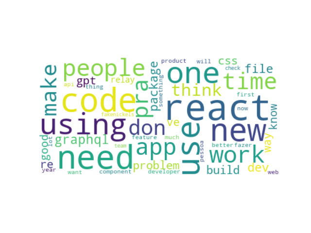

# Coleta e limpeza de dados do Twitter
Este código usa a API do Twitter para pegar os últimos mil tweets de um usuário e criar uma wordcloud com os principais termos usados por ele. É implementada a conexão com a API, a paginação dos dados e a parte de "limpeza" dos textos, que é muito importante antes da implementação de qualquer algoritmo de análise. Abaixo um exemplo de wordclooud gerada:

